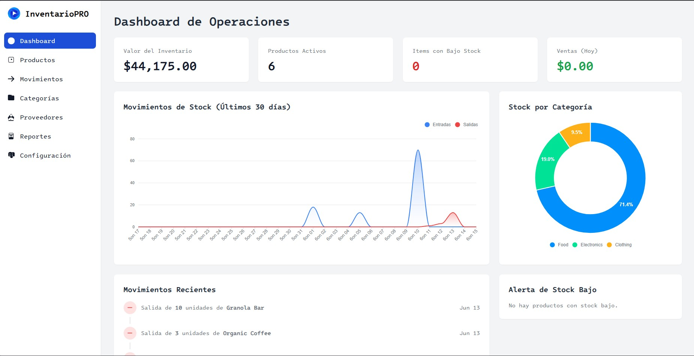

# InventarioPRO - Sistema de Gestión de Inventario

Sistema web moderno para gestión de inventario desarrollado con Lucee CFML y PostgreSQL.

## Características

- 📊 Dashboard interactivo con métricas en tiempo real
- 📦 Control de stock multi-almacén
- 📈 Gráficos de tendencias y distribución
- 🔔 Alertas de bajo stock
- 📱 Diseño responsive con Tailwind CSS
- 📊 Visualización de datos con ApexCharts

## Tecnologías

- **Backend:** Lucee CFML
- **Base de datos:** PostgreSQL 16
- **Frontend:** TailwindCSS, ApexCharts
- **Contenedores:** Podman/Docker

## Capturas de Pantalla

### Dashboard Principal



## Instalación

1. Clonar el repositorio:
```bash
git clone https://github.com/runckoode/lucee-dev-knowlage.git
```

2. Iniciar los contenedores:
```bash
cd cms-server
podman-compose up -d
```

3. Acceder al sistema:
   - URL: http://localhost:8888
   - Usuario por defecto: admin
   - Contraseña por defecto: password123

## Estructura del Proyecto

```
cms-server/
├── config/
│   └── lucee/              # Configuración de Lucee
├── www/
│   ├── components/         # Componentes CFC
│   ├── includes/          # Fragmentos de UI
│   └── Application.cfc    # Configuración de la aplicación
├── create.sql             # Esquema de base de datos
├── insert.sql            # Datos de prueba
├── Dockerfile            # Configuración de contenedor
└── podman-compose.yml    # Configuración de servicios
```

## Contribuir

1. Fork el proyecto
2. Crear una rama de características (`git checkout -b feature/NuevaCaracteristica`)
3. Commit los cambios (`git commit -am 'Añadir nueva característica'`)
4. Push a la rama (`git push origin feature/NuevaCaracteristica`)
5. Crear un Pull Request

## Base de Datos

El sistema utiliza PostgreSQL con un esquema optimizado para gestión de inventario:

- Gestión de productos y categorías
- Control de stock multi-almacén
- Registro de movimientos
- Sistema de proveedores
- Histórico de ventas y compras

## Licencia

Este proyecto está bajo la Licencia MIT. Ver el archivo [LICENSE](LICENSE) para más detalles.